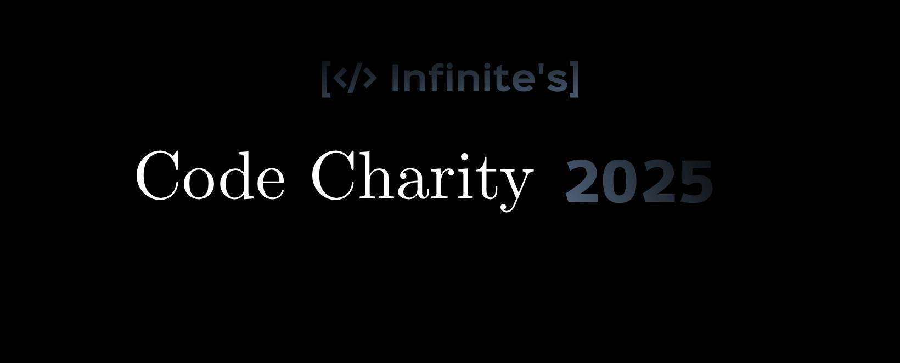

# tinywrench-core

A lightweight _universal_ library that automates system tasks like installing software, managing users, and detecting system info. Works with **Python, Rust, Go, and C++**.

## Features

- **Cross-platform**: Works on Linux, macOS, and Windows
- **Multi-language**: Can be used in Python, Rust, Go, and C++
- **Automated software installation**: Uses package managers like `apt`, `brew`, `winget`, etc.
- **System detection**: Identifies OS and package manager

## Installation

### **1️. Clone the Repository**

```bash
git clone https://github.com/infinitestate/tinywrench-core.git
cd tinywrench-core
```

### **2. Build with CMake**

```bash
mkdir -p build
cd build
cmake ..
cmake --build .
```

## Usage

### Python:

```py
import ctypes

# Load the shared library
lib = ctypes.CDLL("./build/lib/libsystem_utils.so")

# Define function signature
lib.install_software.argtypes = [ctypes.c_char_p]
lib.install_software.restype = None

# Install a package (e.g., curl)
lib.install_software(b"curl")

```

Or use the pre-made example:

```bash
python3 examples/python_example.py
```

## Contributing

We welcome contributions to improve this library! If you'd like to contribute, please follow these steps:

1.  Fork the repository.
2.  Create a new branch (`git checkout -b feature-name`).
3.  Make your changes and commit (`git commit -am 'Add new feature'`).
4.  Push to your branch (`git push origin feature-name`).
5.  Create a new Pull Request.

---

## License

This project is licensed under the MIT License - see the LICENSE file for details.

---

## Roadmap

Future features planned for this library:

- Easier API syntax with Python by making a PyPi package.
- Add Playbook support
- Add more features
- Fix and finish LLM integration.

## Version & Branches

| Branch      | Version |                  |
| ----------- | ------- | ---------------- |
| Stable      | 0.0.0   | [In Development] |
| Development | 0.1.0   |                  |

---

## Part of Infinite's Code Charity 2025 Event



# Join and Contribute!
